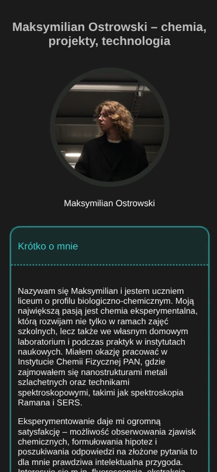
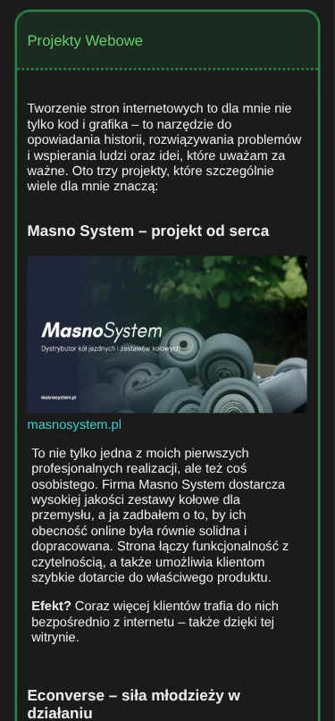
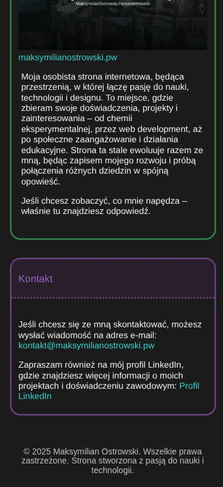

# maksymilianostrowski.pw

Szybki projekt, który miał na celu stworzenie strony internetowej będącej rozszerzeniem mojego opisu na Instagramie. Przerodził się on w projekt mający  na celu utworzenie i rozwijanie personalnej strony internetowej gdzie mógłbym podzielić się moją misją, tym co robię i co mnie interesuje.  

## Opis

Projekt `maksymilianostrowski.pw` to prosta strona internetowa służąca jako rozszerzenie opisu mojego profilu na Instagramie oraz LinkedIn. Strona zawiera dodatkowe informacje oraz multimedia, które nie mieszczą się w ograniczonej przestrzeni profilu na Instagramie/LinkedIn oraz są sformatowane w wyróżniającej się i zapadającej w pamięć formie.

## Zrzuty ekranu

<p style="display: flex; gap: 10px; ">



</p>

## Funkcjonalności

- Prezentacja szczegółowego opisu mojej osoby
- Odnośniki do realizowanych przeze mnie projektów webowych
- Sekcja kontaktowa z informacją o możliwości napisania wiadomości na podany adres email albo kontakt za pośrednictwem platformy LinkedIn

## Technologie

Projekt został zbudowany z użyciem następujących języków:

- HTML
- CSS
- JavaScript

## Instalacja

Aby uruchomić projekt lokalnie, wykonaj następujące kroki:

1. Sklonuj repozytorium:
    ```bash
    git clone https://github.com/whatkindofmilkuare/maksymilianostrowski.pw.git
    ```

2. Przejdź do katalogu projektu:
    ```bash
    cd maksymilianostrowski.pw
    ```

3. Otwórz plik `index.html` w przeglądarce.

## Użycie

Po otwarciu pliku `index.html` w przeglądarce, zobaczysz stronę z dodatkowym opisem i multimediami, które można przeglądać.

## Licencja

Ten projekt udostępniany jest na licencji MIT. 
Przeznaczony jest to użytku publicznego. Można wykorzystać go jako szablon dla swojego rozszerzenia opisu na Instagramie. Szczegóły o licencji w pliku ```LICENSE```
